```mermaid
graph TB
    %% Registro y Verificación
    A["👤 Estudiante se registra"] --> B["🔒 SEP-0012 KYC/AML"]
    B --> C["🏫 API Universidades"]
    C --> D{"✅ Validación exitosa?"}
    D -->|No| E["❌ Rechazo de solicitud"]
    D -->|Sí| F["📝 Contrato Soroban: Registrar Estudiante"]

    %% Registro en Soroban
    F --> G["registrar_estudiante(id, puntaje_inicial)"]
    G --> H["💾 Guardar datos validados"]
    H --> I["📊 Contrato Soroban: Calcular Scoring"]

    %% Sistema de Scoring
    I --> J["actualizar_scoring(id, nota, asistencia)"]
    J --> K["🧮 Recalcular puntaje crediticio"]
    K --> L["💰 Contrato Soroban: Solicitar Préstamo"]

    %% Solicitud de Préstamo
    L --> M["solicitar_prestamo(id, monto)"]
    M --> N{"📋 Puntaje mínimo cumplido?"}
    N -->|No| O["❌ Préstamo rechazado"]
    N -->|Sí| P["✅ Verificar puntaje mínimo"]
    P --> Q["📑 Registrar condiciones préstamo"]
    Q --> R["⭐ Stellar Ledger"]

    %% Procesamiento en Stellar
    R --> S["🔗 Registrar préstamo aprobado"]
    S --> T["👨‍🎓 Asociar a cuenta estudiante"]
    T --> U["💵 Circle USDC en Stellar"]
    U --> V["🌐 MoneyGram Access"]

    %% Conversión y Entrega
    V --> W["💱 Convertir USDC a fiat"]
    W --> X["🏦 Entrega en moneda local"]
    X --> Y["💰 ARS / BRL / CLP"]
    Y --> Z["✨ Estudiante recibe préstamo"]

    %% Sistema de Pagos y Seguimiento
    Z --> AA["📅 Seguimiento de pagos"]
    AA --> BB["📊 Datos desde Stellar Ledger"]
    BB --> CC["💳 Contrato Soroban: Registrar Pago"]
    CC --> DD["registrar_pago(id, monto)"]
    DD --> EE["📈 Actualizar scoring según cumplimiento"]
    EE --> FF["📋 Contrato Soroban: Historial"]

    %% Dashboard y Métricas
    FF --> GG["obtener_historial(id)"]
    GG --> HH["📊 Dashboard de Impacto"]
    HH --> II["📈 Stellar Expert API"]
    II --> JJ["🎯 Métricas de desempeño"]
    JJ --> KK["🌍 Impacto social"]

    %% Gamificación y Recompensas
    EE --> LL["🎮 Sistema de Gamificación"]
    LL --> MM["🏆 Logros académicos"]
    MM --> NN["💎 Recompensas en Stellar"]
    NN --> OO["🎓 Becas y beneficios"]

    %% Ciclo de Retroalimentación
    OO --> PP["🔄 Actualización de puntaje"]
    PP --> I

    %% Estilos
    classDef studentNode fill:#e1f5fe,stroke:#0277bd,stroke-width:2px
    classDef stellarNode fill:#fff3e0,stroke:#f57f17,stroke-width:2px
    classDef sorobanNode fill:#e8f5e8,stroke:#2e7d32,stroke-width:2px
    classDef apiNode fill:#fce4ec,stroke:#c2185b,stroke-width:2px
    classDef rewardNode fill:#f3e5f5,stroke:#7b1fa2,stroke-width:2px

    class A,Z,AA studentNode
    class R,S,T,U,BB stellarNode
    class F,G,H,I,J,K,L,M,P,Q,CC,DD,EE,FF,GG sorobanNode
    class B,C,V,W,II apiNode
    class LL,MM,NN,OO,PP rewardNode
```

# Not Your Jewels 🎓💎
**Plataforma gamificada de microcréditos estudiantiles construida en blockchain Stellar**

Una solución descentralizada para abordar las tasas de deserción universitaria en Latinoamérica mediante micropréstamos basados en blockchain con incentivos por rendimiento académico.

---

## 🚨 El Problema
Las tasas de deserción universitaria por limitaciones financieras son críticamente altas en Latinoamérica:

- **57%** de deserción en *Guatemala*
- **53%** de deserción en *Honduras*
- **16%** de deserción en *Bolivia*

Muchos estudiantes recurren a **empeñar pertenencias personales**, incluyendo joyas, para continuar su educación.  
Esto representa un **fallo sistémico** donde la educación se convierte en privilegio en lugar de un derecho.

---

## 💡 Nuestra Solución
**Not Your Jewels** es una plataforma gamificada de microcréditos diseñada para proporcionar financiamiento educativo basado en blockchain con incentivos impulsados por el rendimiento.

La plataforma aprovecha la infraestructura de **Stellar** para crear micropréstamos **transparentes y accesibles** para estudiantes, implementando mecánicas de gamificación para fomentar la excelencia académica.

**Características principales:**
- Sistema de **scoring académico** para evaluación crediticia.
- Recompensas basadas en rendimiento a través de **gamificación**.
- Opciones de pago flexibles adaptadas a ciclos financieros estudiantiles.
- Registros blockchain **transparentes** de todas las transacciones y logros.
- Integración **USDC stablecoin** para estabilidad de precios.
- Conversión a **fiat** mediante *MoneyGram Access*.

---

## 🔧 Cómo Funciona

### **Para Estudiantes**
1. **Registro y verificación** → Conectan wallet y validan identidad mediante **SEP-0012**.
2. **Evaluación académica** → El sistema calcula *scoring* basado en rendimiento universitario.
3. **Solicitud de préstamo** → Acceden a microcréditos según su puntaje crediticio.
4. **Gamificación** → Participan en desafíos académicos para mejorar condiciones.
5. **Repago flexible** → Opciones de pago adaptadas a su situación financiera.

---

### **Para Personas Administradoras**
1. **Autenticación institucional** → Verificación como institución educativa o inversor.
2. **Configuración de pools** → Creación y financiamiento de fondos de préstamos.
3. **Diseño de desafíos** → Implementación de retos académicos gamificados.
4. **Monitoreo** → Seguimiento de métricas de impacto y rendimiento.

---




# 🛠️ Stack Tecnológico

## **Frontend**
El frontend utiliza las siguientes tecnologías:
- **Next.js** → Framework de React para aplicaciones web.
- **TypeScript** → Tipado estático para mayor robustez.
- **Tailwind CSS** → Framework de estilos utilitarios.
- **Stellar SDK** → Integración con la red Stellar.
- **React Query** → Gestión de estado asíncrono.
- **Firebase** → Base de datos y autenticación.

---

## **Smart Contracts**
Los Smart Contracts van a estar construidos con:
- **Soroban** → Smart contracts nativos de Stellar.
- **Stellar CLI** → Herramientas de desarrollo para Stellar.
- **Rust** → Lenguaje de programación para Soroban.

---

# 📝 Smart Contracts en Soroban

### **1. StudentRegistry**
Contrato *factory* que crea y gestiona el registro de estudiantes, basado en configuraciones establecidas por las instituciones educativas.

### **2. NYJToken**
Token nativo de la plataforma que sirve como moneda interna.  
Mantiene un registro histórico de logros académicos incluso después del uso de tokens para beneficios.

### **3. LoanPoolFactory**
Contrato *factory* que crea diferentes tipos de *pools* de préstamos con lógicas de recompensas y condiciones crediticias personalizadas.

### **4. LoanPool**
*Pool* financiado por inversores institucionales, con diferentes lógicas de recompensa:  
- Tasa fija  
- Variables basadas en rendimiento  
- Distribución cuadrática para equidad

### **5. AcademicOracle**
Oráculo que consulta APIs universitarias para validar rendimiento académico y matrícula activa.

### **6. PaymentTracker**
Sistema de seguimiento de pagos que registra cumplimiento y actualiza el *scoring* crediticio según historial de pagos.

---

## 🔧 Detalles de Implementación
- **Verificación de identidad:**  
  Utilizamos el protocolo **SEP-0012** de Stellar para procesos KYC/AML.  
  Integración con APIs universitarias latinoamericanas para validación académica.

**Resumen de nuestro ideal de contratos:**
- `StudentRegistry` → Registro y gestión de perfiles estudiantiles.  
- `NYJToken` → Token de plataforma con historial académico integrado.  
- `LoanPoolFactory` → Creación de *pools* de préstamos.  
- `LoanPool` → Lógicas personalizadas de distribución de fondos.  
- `AcademicOracle` → Validación académica en tiempo real.  
- `PaymentTracker` → Seguimiento y *scoring* de pagos.

---

## ✅ Contratos Verificados *(Próximamente)*
Estos contratos serán desplegados y verificados en **Stellar Mainnet**:
- **StudentRegistry** *(En desarrollo)*  
- **NYJToken** *(En desarrollo)*  
- **LoanPoolFactory** *(En desarrollo)*  
- **LoanPool** *(En desarrollo)*  
- **AcademicOracle** *(En desarrollo)*  
- **PaymentTracker** *(En desarrollo)*

---

## 🚀 Inicio Rápido

### **Frontend**
1. Navega a la carpeta del frontend:  
   ```bash
   cd frontend
   npm install
   ```
2. Inicia la aplicación Next.js:
   ```bash
    npm run dev
   ```
3. La aplicación se ejecutará en:
   ```bash
    http://localhost:3000
   ```
   
## 🎯 Roadmap

- **Q1 2025**: Despliegue MVP en red Testnet de Stellar  
- **Q2 2025**: Lanzamiento en Argentina e integración con universidades  
- **Q3 2025**: Expansión a Brasil, Chile y Bolivia  
- **Q4 2025**: Programa de inversores institucionales y métricas de impacto  

---

## 🎮 Sistema de Gamificación

- 🏆 **Logros académicos**: Recompensas NYJ por notas sobresalientes  
- 📚 **Desafíos de aprendizaje**: Trivia y cuestionarios sobre educación financiera  
- ⭐ **Sistema de niveles**: Progresión basada en rendimiento académico y cumplimiento  
- 💎 **Tokens de recompensa**: Beneficios tangibles en la red Stellar  
- 🏅 **Becas de rendimiento**: Reducción de intereses por excelencia académica  

---

## 📞 Contacto

- **Website**: [https://not-your-jewels.vercel.app/](https://not-your-jewels.vercel.app/)  
- **Correo**: notyourjewelsdapp@gmail.com

---

### Recursos 

- [Video explicativo](https://youtube.com/watch?v=cS9_8sArmFQ)
- Dorahacks: [https://dorahacks.io/buidl/30925/](https://dorahacks.io/buidl/30925/)
- Sitio web: [not-your-jewels.vercel.app](https://not-your-jewels.vercel.app)
- Twitter: [@notyourjewelslatam](https://twitter.com/notyourjewelslatam)
- Instagram: [@notyourjewelslatam](https://www.instagram.com/notyourjewelslatam/)
- Diseño Canva: [Enlace al diseño](https://www.canva.com/design/DAGvnJLYsqA/Z5KcT51yfTJACXmpkDwMFg/edit?utm_content=DAGvnJLYsqA&utm_campaign=designshare&utm_medium=link2&utm_source=sharebutton)

---

## 🤝 Equipo

- [Emmi Aguilar Rivero](https://www.linkedin.com/in/emmi-aguilar-rivero/)
- [Maria Elisa Araya](https://www.linkedin.com/in/arayamariaelisa/)
- [Tatiana Borda](https://www.linkedin.com/in/tatiana-borda/)
 
---


💎 **Not Your Jewels — Ningún estudiante debería perder sus joyas para no perder su futuro** 💎
