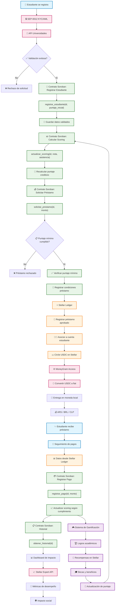

```mermaid
graph TB
    %% Registro y Verificación
    A["👤 Estudiante se registra"] --> B["🔒 SEP-0012 KYC/AML"]
    B --> C["🏫 API Universidades"]
    C --> D{"✅ Validación exitosa?"}
    D -->|No| E["❌ Rechazo de solicitud"]
    D -->|Sí| F["📝 Contrato Soroban: Registrar Estudiante"]

    %% Registro en Soroban
    F --> G["registrar_estudiante(id, puntaje_inicial)"]
    G --> H["💾 Guardar datos validados"]
    H --> I["📊 Contrato Soroban: Calcular Scoring"]

    %% Sistema de Scoring
    I --> J["actualizar_scoring(id, nota, asistencia)"]
    J --> K["🧮 Recalcular puntaje crediticio"]
    K --> L["💰 Contrato Soroban: Solicitar Préstamo"]

    %% Solicitud de Préstamo
    L --> M["solicitar_prestamo(id, monto)"]
    M --> N{"📋 Puntaje mínimo cumplido?"}
    N -->|No| O["❌ Préstamo rechazado"]
    N -->|Sí| P["✅ Verificar puntaje mínimo"]
    P --> Q["📑 Registrar condiciones préstamo"]
    Q --> R["⭐ Stellar Ledger"]

    %% Procesamiento en Stellar
    R --> S["🔗 Registrar préstamo aprobado"]
    S --> T["👨‍🎓 Asociar a cuenta estudiante"]
    T --> U["💵 Circle USDC en Stellar"]
    U --> V["🌐 MoneyGram Access"]

    %% Conversión y Entrega
    V --> W["💱 Convertir USDC a fiat"]
    W --> X["🏦 Entrega en moneda local"]
    X --> Y["💰 ARS / BRL / CLP"]
    Y --> Z["✨ Estudiante recibe préstamo"]

    %% Sistema de Pagos y Seguimiento
    Z --> AA["📅 Seguimiento de pagos"]
    AA --> BB["📊 Datos desde Stellar Ledger"]
    BB --> CC["💳 Contrato Soroban: Registrar Pago"]
    CC --> DD["registrar_pago(id, monto)"]
    DD --> EE["📈 Actualizar scoring según cumplimiento"]
    EE --> FF["📋 Contrato Soroban: Historial"]

    %% Dashboard y Métricas
    FF --> GG["obtener_historial(id)"]
    GG --> HH["📊 Dashboard de Impacto"]
    HH --> II["📈 Stellar Expert API"]
    II --> JJ["🎯 Métricas de desempeño"]
    JJ --> KK["🌍 Impacto social"]

    %% Gamificación y Recompensas
    EE --> LL["🎮 Sistema de Gamificación"]
    LL --> MM["🏆 Logros académicos"]
    MM --> NN["💎 Recompensas en Stellar"]
    NN --> OO["🎓 Becas y beneficios"]

    %% Ciclo de Retroalimentación
    OO --> PP["🔄 Actualización de puntaje"]
    PP --> I

    %% Estilos
    classDef studentNode fill:#e1f5fe,stroke:#0277bd,stroke-width:2px
    classDef stellarNode fill:#fff3e0,stroke:#f57f17,stroke-width:2px
    classDef sorobanNode fill:#e8f5e8,stroke:#2e7d32,stroke-width:2px
    classDef apiNode fill:#fce4ec,stroke:#c2185b,stroke-width:2px
    classDef rewardNode fill:#f3e5f5,stroke:#7b1fa2,stroke-width:2px

    class A,Z,AA studentNode
    class R,S,T,U,BB stellarNode
    class F,G,H,I,J,K,L,M,P,Q,CC,DD,EE,FF,GG sorobanNode
    class B,C,V,W,II apiNode
    class LL,MM,NN,OO,PP rewardNode
```
